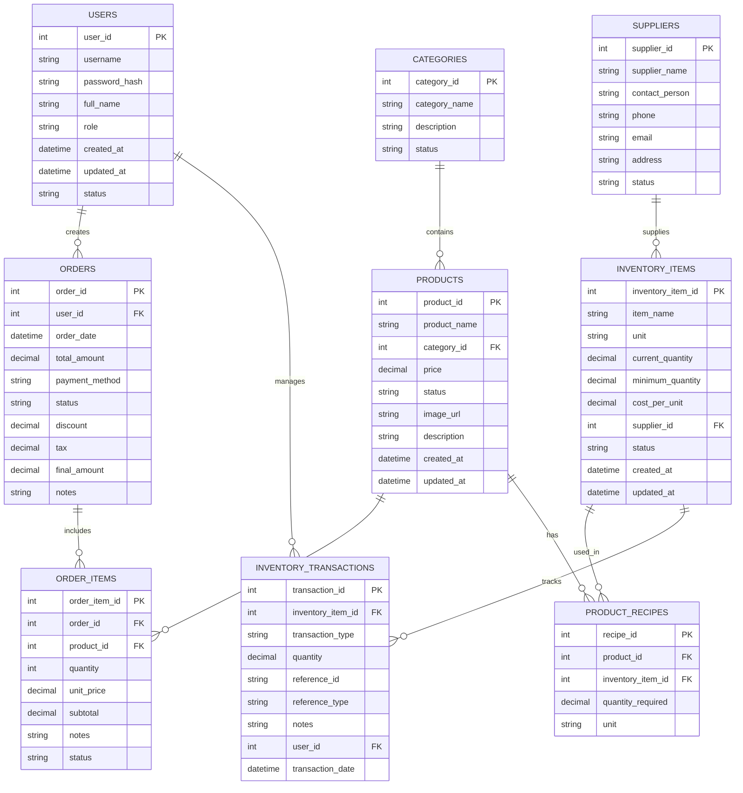

# การออกแบบระบบ POS Cafe และระบบจัดการสต็อก

## 1. ภาพรวมระบบ

ระบบประกอบด้วยโมดูลหลักดังนี้:
1. ระบบจัดการหน้าร้าน (POS)
2. ระบบจัดการสต็อกสินค้า
3. ระบบจัดการวัตถุดิบ
4. ระบบรายงาน
5. ระบบจัดการผู้ใช้งาน

## 2. แผนผังฐานข้อมูล

### ตารางหลัก

1. **users**
   - user_id (PK)
   - username
   - password_hash
   - full_name
   - role
   - created_at
   - updated_at
   - status

2. **products**
   - product_id (PK)
   - product_name
   - category_id (FK)
   - price
   - status
   - image_url
   - description
   - created_at
   - updated_at

3. **categories**
   - category_id (PK)
   - category_name
   - description
   - status

4. **orders**
   - order_id (PK)
   - user_id (FK)
   - order_date
   - total_amount
   - payment_method
   - status
   - discount
   - tax
   - final_amount
   - notes

5. **order_items**
   - order_item_id (PK)
   - order_id (FK)
   - product_id (FK)
   - quantity
   - unit_price
   - subtotal
   - notes
   - status

6. **inventory_items**
   - inventory_item_id (PK)
   - item_name
   - unit
   - current_quantity
   - minimum_quantity
   - cost_per_unit
   - supplier_id (FK)
   - status
   - created_at
   - updated_at

7. **product_recipes**
   - recipe_id (PK)
   - product_id (FK)
   - inventory_item_id (FK)
   - quantity_required
   - unit

8. **inventory_transactions**
   - transaction_id (PK)
   - inventory_item_id (FK)
   - transaction_type (IN/OUT)
   - quantity
   - reference_id
   - reference_type
   - notes
   - user_id (FK)
   - transaction_date

9. **suppliers**
   - supplier_id (PK)
   - supplier_name
   - contact_person
   - phone
   - email
   - address
   - status

## 3. ฟังก์ชันการทำงานหลัก

### ระบบ POS
1. การสร้างออเดอร์ใหม่
2. การเพิ่ม/ลบ/แก้ไขรายการสินค้าในออเดอร์
3. การคำนวณราคารวม ส่วนลด และภาษี
4. การเลือกวิธีการชำระเงิน
5. การพิมพ์ใบเสร็จ
6. การยกเลิกออเดอร์

### ระบบจัดการสต็อก
1. การตัดสต็อกอัตโนมัติเมื่อมีการขาย
   - เมื่อมีการบันทึกออเดอร์ ระบบจะ:
     * ดึงข้อมูลสูตรของสินค้าจากตาราง product_recipes
     * คำนวณปริมาณวัตถุดิบที่ต้องใช้
     * บันทึกรายการตัดสต็อกในตาราง inventory_transactions
     * อัพเดทปริมาณคงเหลือในตาราง inventory_items
2. การแจ้งเตือนเมื่อสต็อกต่ำกว่าที่กำหนด
3. การนำเข้าสต็อกใหม่
4. การตรวจนับสต็อก
5. การดูประวัติการเคลื่อนไหวของสต็อก

### ระบบรายงาน
1. รายงานยอดขายประจำวัน/เดือน/ปี
2. รายงานสินค้าขายดี
3. รายงานสต็อกคงเหลือ
4. รายงานการเคลื่อนไหวสต็อก
5. รายงานกำไร-ขาดทุน
6. รายงานประวัติการสั่งซื้อวัตถุดิบ

## 4. การรักษาความปลอดภัย
1. การจัดการสิทธิ์ผู้ใช้งาน (Role-based Access Control)
2. การเข้ารหัสข้อมูลที่สำคัญ
3. การเก็บประวัติการใช้งานระบบ (Audit Log)
4. การสำรองข้อมูล

## 5. การเชื่อมต่อระบบ
1. ระบบสามารถเชื่อมต่อกับ:
   - เครื่องพิมพ์ใบเสร็จ
   - เครื่องอ่านบาร์โค้ด
   - ระบบบัญชี
   - แอพพลิเคชั่นมือถือสำหรับดูรายงาน

